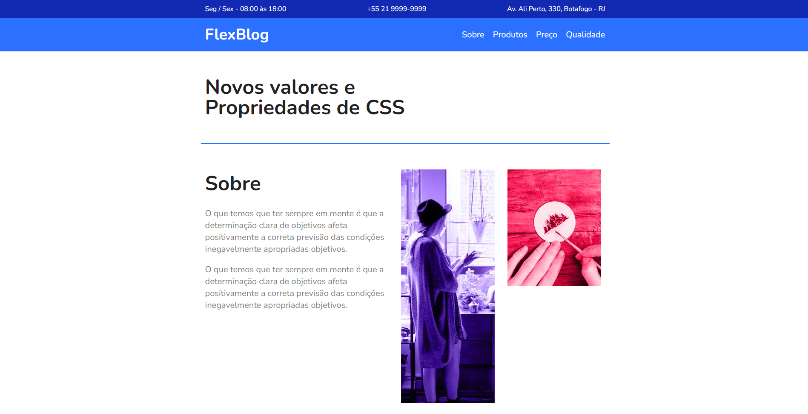

  <h1>FlexBlog</h1>

  

# :red_circle: Sobre o Projeto
Projeto fictício realizado durante o modulo no CSS Flexbox da Origamid, site desenvolvido inteiramente com flexbox e responsivo.

# ⚡ Tecnologias
Desenvolvido com as seguintes ferramentas:

* HTML5
* CSS3
* Flexbox

[:mortar_board: Certificado do Curso](https://www.origamid.com/certificate/5f70a663/)

## :memo: Licença
Esse projeto está sob a licença MIT. Veja o arquivo [LICENSE](LICENSE.md) para mais detalhes.